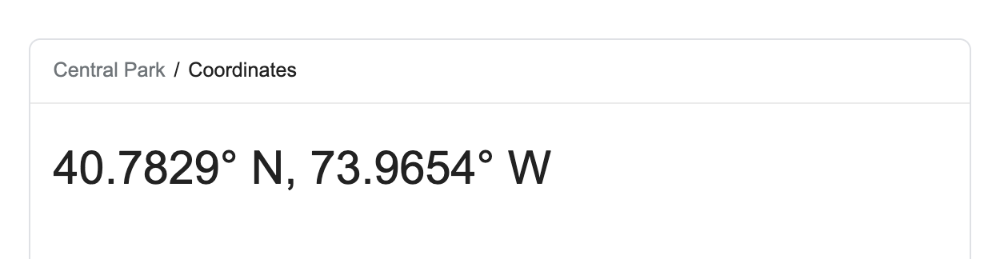

```{r child = "../setup.Rmd"}
```

```{r packages, echo = FALSE, message=FALSE, warning=FALSE}
library(tidyverse)
```

class: middle

# What's in a data analisis?

---

## Five core activities of data analysis

1. Stating and refining the question
1. Exploring the data
1. Building formal statistical models
1. Interpreting the results
1. Communicating the results

.footnote[
Roger D. Peng and Elizabeth Matsui. "The Art of Data Science." A Guide for Anyone Who Works with Data. Skybrude Consulting, LLC (2015).
]

---

class: middle

# Stating and refining the question

---

## Six types of questions

1. **Descriptive:** summarize a characteristic of a set of data
1. **Exploratory:** analyze to see if there are patterns, trends, or relationships between variables (hypothesis generating)
1. **Inferential:** analyze patterns, trends, or relationships in representative data from a population
1. **Predictive:** make predictions for individuals or groups of individuals
1. **Causal:** whether changing one factor will change another factor, on average, in a population
1. **Mechanistic:** explore "how" as opposed to whether

.footnote[
Jeffery T. Leek and Roger D. Peng. "What is the question?." Science 347.6228 (2015): 1314-1315.
]

---

## Ex: Relation between investin in AI and innovating 

1. **Descriptive:** frequency of patents filled by a set of companies 
--

1. **Exploratory:** examine relationships between investing in AI technologies and the number of filled patents
--

1. **Inferential:** examine whether any relationship between investing in AI and number of patents found in the sample hold for the population at large

--
1. **Predictive:** what class (sector, dimensions...) of company will get an increased number of patents when investing in AI

--
1. **Causal:** whether companies that invests in AI patents more than companies that are not investing in AI, if the groups are taken randomly

--
1. **Mechanistic:** how many money invested in AI produces on average an increment of 1 patent 

---

---

## Everything starts with a question

1. **What**  can  we  define  a  good  question  in the context of SCI? 
2. **When** do questions comes up? 
3. **Who** in the company generates questions?
4. **Where** can I find interesting questions?
5. **Why**  is it so important to generate questions?

```{r echo=FALSE, out.width='40%'}
knitr::include_graphics('./img/question.png', error = FALSE)
```

---

## Questions to SCI problems

- Do you have appropriate data to answer your question?
- Do you have information on confounding variables?
- Was the data you're working with collected in a way that introduces bias?

--

.question[
Suppose I want to estimate the average number of children in households in Edinburgh. I conduct a survey at an elementary school in Edinburgh and ask students at this elementary school how many children, including themselves, live in their house. Then, I take the average of the responses. Is this a biased or an unbiased estimate of the number of children in households in Edinburgh? If biased, will the value be an overestimate or underestimate?
]

---
##KIT & KIQ

.question[
**Key  Intelligence  Topics**  (KITs)  are  thekey questions that competitive intelligence  professionals  are trying  to answer about what’s happening outside of  their     organizations,  the  “what  you need to know” to be successful.
] 

.question[
**Key Intelligence Questions** (KIQs) are the  specific  questions you are trying to understand within a given topic.
] 

```{r echo=FALSE, out.width='30%'}
knitr::include_graphics('./img/road.png', error = FALSE)
```

---

##KIT & KIQ

```{r echo=FALSE, out.width='70%'}
knitr::include_graphics('./img/kit_schema.png', error = FALSE)
```

---
##Key Intelligence Topics

1. *Strategic KITs*: contribute to key decisions in relation to strategic formulations and implementation for the company. Strategic KITs are used to make determine on actions such as: investment decisions, global expansion, technological competitiveness, global alliances and/or acquisitions. 
2. *Early Warning KITs*: identify forthcoming threats and opportunities for the company in the market. Some examples of Early Warning KITs include: new entrant threats, government regulations, untapped market, and any shifts in bargaining power. 
3. *Key Players KITs*: arise from market rivalries, new entrants, and substitute products. However, Key Player KITs can also deal with none threatening means such as new suppliers or contractors which have entered the market as well.

---
##Key Intelligence Questions

In the example below, if the KIT is competitor reaction to a new product, your KIQs might be: 

**Money**
1. What are they currently spending on R&D? Has that changed in the last 3 years?
2. Who are they hiring (and what salaries come with that)?
3. What's their current cash flow situation? Portfolio and 

--

**Market**

5. Are they trying to reach new markets? 
5. Where is their product in terms of market maturity and adoption? 
6. What percentage of the market do they hold? 

---
##Key Intelligence Questions

**Man** 
7. Are the senior leaders risk averse or risk-takers? 
8. What actions and decisions have they made in the past?
9. What do their employee think about the company?

--
**Machines** 
10. What technologies are they investing on?
11. Do they have the proper technologies for thier processes?
12. Do some recent changes in the technological environemnt have an impact on them?
13.

---

class: middle

#Kit vs Research Questions

###Let's brainstorm 🧠


---

## KIT & CRITICAL THINKING

1. Critical thinking is the process of thinking critically about **your owns** thoughts.
2. One of the most important steps is challenging **your own** assumption.
3. In a company context this means challenging **company’s** assumption
4. **Question asking** is fundamental for critical thinking and vice-versa


[What is Critical Thinking?](https://en.wikipedia.org/wiki/Critical_thinking) 🔍 
---

## WHAT IS THE POWER OF KIT?

1. **Define an Investigation**: Can inform both you and the company on the topic and the nature of the investigation (to discover, to explore, to explain, to describe to compare) 

2. **Set Boundaries**: Every time you face a new interesting direction, you can decide if follow it or not considering your starting research question 

3. **Provide Direction**: It will point you towards theory you need to explore, literature you need to review, the methods you may need to call on, data you need to gather, and person you need to interview.

4. **Identify Stop Criteria**: A univocal point of arrive will help you understand when you will not have to invest resources on a specifi c research direction. 

---
## HOW DO I ARTICULATE MY KIT?

.question[
**CLARITY**: All the potential stakeholders can get the gist of your research just by reading your question. Maybe you will have to rephrase your question in different ways, depending on who will read it.
]

--

.question[
**SPECIFICITY**: The KIT has to capture the nature of your research without being too broad. The goal is to avoid ambiguity and fuzziness, because being precise make the research task easier.
]

.question[
**USEFULNESS**: The KIT has to answer a questions that the company cares about. In other words, if you are able to solve the KIT, the company will create more value: more money 💰, less resources 🥬.
]


---


class: middle

# Exploratory data analysis (EDA)

---


#EDAs: whats the danger?

##Let's brainstorm 🧠


---

## Checklist

- Formulate your question
- Read in your data
- Check the dimensions
- Look at the top and the bottom of your data
- Validate with at least one external data source
- Make a plot
- Try the easy solution first

---

class: middle, centered

# Formulate your question
### Approaches? 📝

---

## Read in your data

- Place your data in a folder called `data`
- Read it into R with `read_csv()` or friends (`read_delim()`, `read_excel()`, etc.)

```{r}
library(readxl)
fav_food <- read_excel("data/favourite-food.xlsx")
fav_food
```

---

## `clean_names()`

If the variable names are malformatted, use `janitor::clean_names()` or othe similar functions

```{r message=FALSE, warning=FALSE}
library(janitor)
fav_food %>% clean_names()  
```

---

## Case study: NYC Squirrels!

- [The Squirrel Census](https://www.thesquirrelcensus.com/) is a multimedia science, design, and storytelling project focusing on the Eastern gray (*Sciurus carolinensis*). They count squirrels and present their findings to the public.
- This table contains squirrel data for each of the 3,023 sightings, including location coordinates, age, primary and secondary fur color, elevation, activities, communications, and interactions between squirrels and with humans.

```{r}
#install_github("mine-cetinkaya-rundel/nycsquirrels18")
library(nycsquirrels18)
```

---

## Locate the codebook

[mine-cetinkaya-rundel.github.io/nycsquirrels18/reference/squirrels.html](https://mine-cetinkaya-rundel.github.io/nycsquirrels18/reference/squirrels.html)

<br><br>

--

## Check the dimensions

```{r}
dim(squirrels)
```

---

## Look at the top...

```{r}
squirrels %>% head()
```

---

## ...and the bottom

.small[
```{r}
squirrels %>% tail()
```
]

---

## Validate with at least one external data source

.pull-left[
```{r echo=FALSE}
squirrels %>%
  select(long, lat) %>%
  print(n = 15)
```
]
.pull-right[
```{r echo=FALSE, out.width="100%"}

```
]

---

## Make a plot

```{r out.width="45%"}
ggplot(squirrels, aes(x = long, y = lat)) +
  geom_point(alpha = 0.2)
```

--

.pull-left-wide[
**Hypothesis:** There will be a higher density of sightings on the perimeter than inside the park.
]

---

## Communicating for your audience

- Avoid: Jargon, uninterpreted results, lengthy output
- Pay attention to: Organization, presentation, flow
- Don't forget about: Code style, coding best practices, meaningful commits
- Be open to: Suggestions, feedback, taking (calculated) risks
